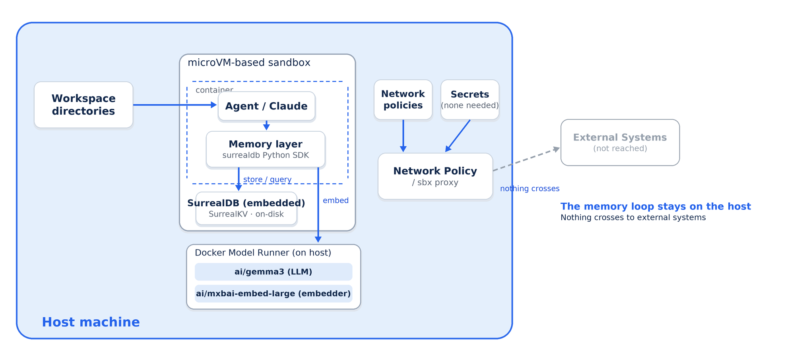
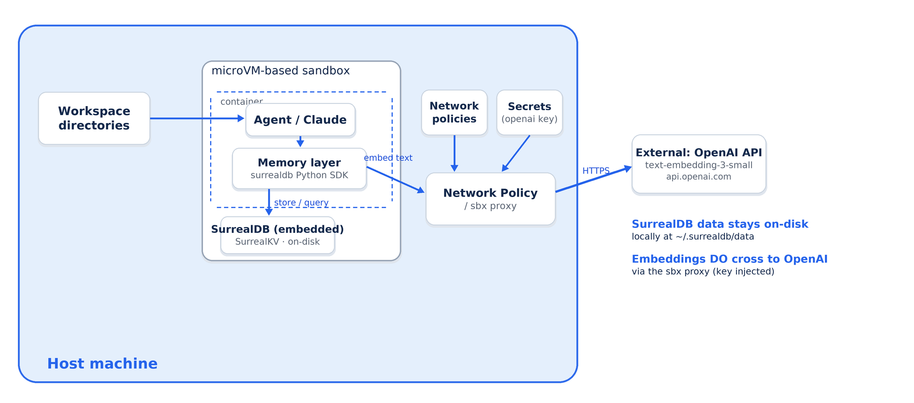

# sbx kits for SurrealDB

This is a standalone [Docker Sandboxes](https://docs.docker.com/ai/sandboxes/) kit
(`kind: mixin`) that adds an embedded, multi-model [SurrealDB](https://surrealdb.com/)
- documents, graph edges, and **native vector search** in one process - plus the
`surrealdb` Python SDK to any sandbox agent. Vector search is pre-wired to a local
[Docker Model Runner](https://docs.docker.com/ai/model-runner/) (DMR) embedder.

SurrealDB runs *inside* the sandbox: the SDK ships with its embedded storage
engines, so there is no server to start and no external database. The store
persists on disk at `~/.surrealdb/data` (surrealkv). One database gives an agent a
document store, a graph, and a vector index at once - so semantic memory needs no
separate vector database like Qdrant.

DMR is the zero-config default for the embedder. It works with no cloud keys, but
the embedder is swappable. See [providers/](./providers/) for copy-paste config
for OpenAI and Gemini.

## Architecture

The agent runs inside a microVM-based sandbox on the host. SurrealDB is **embedded**
in-process and persists to `~/.surrealdb/data` (surrealkv), so the document, graph,
and vector store never leaves the machine. The only part that can reach out is
embedding generation - and whether it does depends on the embedder tag you pick.

### Default (`:dmr`) - fully on-host



With the default **`:dmr` tag** the embedder runs on the host via Docker Model
Runner (`ai/mxbai-embed-large`). The whole memory loop - store, embed, query -
stays on the machine and nothing crosses to external systems.

### Swapped to `:openai` - embeddings cross out



With the **`:openai` tag**, embeddings are produced by OpenAI's
`text-embedding-3-small`, routed through the sbx proxy (which injects the stored
key). That call *does* cross to an external system, while the vector data itself
still stays on-disk locally. The `:gemini` tag behaves the same way against
Google's API.

_Both diagrams are generated by [`docs/make_diagram.py`](./docs/make_diagram.py),
which emits the PNGs and their editable SVGs
([dmr](./docs/surrealdb_architecture_dmr.svg),
[openai](./docs/surrealdb_architecture.svg))._

## Prerequisites

### 0. Login to Docker Hub

```console
sbx login
```

### 1. Preparing the host

Docker Model Runner must be enabled in Docker Desktop (Settings → AI / Beta
features) and the two models pulled before you start (needed for the default DMR
tag and the `travel.py` runbook):

```console
docker model pull ai/gemma3              # chat model for the travel runbook
docker model pull ai/mxbai-embed-large   # embedder (1024-dim)
```

SurrealDB itself needs no pull - it's embedded in the Python SDK the kit installs.

### 2. Setting up the secret key (cloud embedders only)

The DMR default needs no key - skip this step. You only set a secret when you swap
the embedder for a cloud provider (OpenAI or Gemini). Store it once with sbx's
secret manager; the key is never baked into the kit, and the sbx proxy injects it
into the sandbox at runtime (`sbx run` has no `-e` flag).

```console
echo "$OPENAI_API_KEY" | sbx secret set -g openai   # OpenAI (-g = all sandboxes)
echo "$GOOGLE_API_KEY" | sbx secret set -g google   # Gemini
```

Running `sbx secret set -g openai` (or `-g google`) with no piped value prompts
you interactively instead. Confirm it's stored:

```console
sbx secret ls
```

### 3. Launch the sandbox with the kit

Layer the mixin onto an agent. Each embedder is published as its own image tag -
pick the one matching the secret you stored in step 2:

```console
# DMR (default, no key needed) - :latest is the same as :dmr
sbx run --kit docker.io/ajeetraina777/sbx-surrealdb-kits:latest claude

# OpenAI - store the key and launch in one line
sbx secret set -g openai && sbx run --kit docker.io/ajeetraina777/sbx-surrealdb-kits:openai claude

# Gemini
sbx secret set -g google && sbx run --kit docker.io/ajeetraina777/sbx-surrealdb-kits:gemini claude
```

Or straight from this repo over git:

```console
sbx run --kit "git+https://github.com/ajeetraina/sbx-kits-surrealdb.git" claude
```

Or from a local clone (the kit lives at the repo root):

```console
git clone https://github.com/ajeetraina/sbx-kits-surrealdb.git
sbx run --kit ./sbx-kits-surrealdb/ claude
```

#### Choosing the agent

The trailing argument (`claude` above) is the **coding agent** that runs inside
the sandbox - a separate axis from the kit tag. The tag (`:dmr`, `:openai`,
`:gemini`) decides what SurrealDB's vector search uses for embeddings; the agent
decides which assistant you interact with. Any supported agent pairs with any tag.

`sbx run --help` lists the available agents:

```
claude, claude-bedrock, codex, copilot, cursor, docker-agent, droid, gemini, kiro, opencode, shell
```

So you can swap `claude` for any of these, for example Codex on OpenAI-backed
embeddings:

```console
sbx secret set -g openai && sbx run --kit docker.io/ajeetraina777/sbx-surrealdb-kits:openai codex
```

Note that `gemini` here is an agent (Google's Gemini CLI), unrelated to the
`:gemini` kit tag (SurrealDB's Gemini embedder) - they are independent choices.
Arguments meant for the agent itself go after a `--` separator, e.g.
`sbx run --kit ...:openai codex -- --help`.

### 4. Confirm the kit installed correctly

Once you're in the sandbox's Claude session, use `!` shell escapes to prove the
mixin is really inside. The kit does four observable things - installs
`surrealdb`, sets env vars, writes `~/.surrealdb/config.json`, and injects a memory
note - so you can verify it on independent layers.

**4a. The SDK is installed (the pinned version, with embedded engines):**

```console
!python3 -c "import surrealdb, importlib.metadata as m; print('surrealdb', m.version('surrealdb'))"
```

Expect `surrealdb 2.0.0` (the exact pin from this kit's `spec.yaml`).

**4b. The mixin's env vars are present** - declared only in the kit's `spec.yaml`,
so they are a fingerprint that the kit (not a manual `pip install`) wired things
up:

```console
!env | grep -E 'SURREALDB_URL|SURREALDB_NS|SURREALDB_DB|OPENAI_BASE_URL'
```

Expect `SURREALDB_URL=surrealkv:///home/agent/.surrealdb/data`,
`SURREALDB_NS=sandbox`, `SURREALDB_DB=memory`.

**4c. The init file the kit wrote exists** (the SurrealDB + embedder config):

```console
!cat /home/agent/.surrealdb/config.json
```

**4d. End-to-end functional proof** - open the embedded database, write a record,
and read it back. This exercises the SDK and the on-disk store in one shot:

```console
!python3 - <<'PY'
from surrealdb import Surreal
db = Surreal("surrealkv:///home/agent/.surrealdb/data")
db.connect()
db.use("sandbox", "smoketest")
db.query("DELETE person;")
db.create("person", {"name": "Ada", "likes": "dark roast coffee"})
print(db.query("SELECT name, likes FROM person;"))
db.close()
PY
```

Expect the row `{'name': 'Ada', 'likes': 'dark roast coffee'}` back.

### 5. Check the sandbox can reach DMR on the host (DMR tag only)

```console
!curl -s http://host.docker.internal:12434/engines/v1/models | head
```

Expect a JSON list including `ai/gemma3` and `ai/mxbai-embed-large`.

### 6. Try a runbook

The kit ships runnable demos under `~/runbooks/`. They are plain files under
[`files/home/runbooks/`](./files/home/runbooks/) in this repo (the
[sbx-kits-contrib][contrib] `files/home/` convention - everything under it is
mirrored into `/home/agent/`), **not** hard-coded into `spec.yaml`.

`travel.py` is a travel assistant that remembers you across separate runs, using
SurrealDB's native vector search over a local-DMR embedding:

```console
!python3 ~/runbooks/travel.py "I'm vegetarian, I like aisle seats. Book me to Lisbon."
!python3 ~/runbooks/travel.py "Plan my return leg."   # fresh process; it still knows you
```

`graph.py` needs no embedder and no keys - it shows the multi-model side
(documents linked by graph edges, traversed inline):

```console
!python3 ~/runbooks/graph.py
```

To add a runbook, drop a `*.py` in `files/home/runbooks/` - it ships
automatically, no `spec.yaml` change.

## Why SurrealDB for agent memory

A vector store gives an agent recall by similarity. SurrealDB gives that **and**
the structure around it, in one embedded database:

- **Documents** - typed records for entities, preferences, and state.
- **Graph** - `RELATE a->edge->b` with properties on the edge, traversed inline
  (`->visited->city`). Relationships a pure vector store can't express.
- **Native vector search** - an HNSW (or MTREE) index and a KNN operator
  (`embedding <|K|> $vec`) with `vector::distance::knn()`, so semantic memory
  needs no separate vector database.

## Swapping the embedding provider

SurrealDB is a semantic memory store here, so an embedder is required to produce
the vectors it indexes. DMR provides it locally by default, which matters most for
Claude agents: Anthropic
[ships no embeddings API](https://docs.anthropic.com/en/docs/build-with-claude/embeddings)
(it points to Voyage). OpenAI and Gemini users can instead reuse a key they
already have.

| Provider | Vector store | Runs where | Credential | Example embed model | Dims |
|---|---|---|---|---|---|
| [DMR](./providers/dmr.md) (default) | SurrealDB (embedded) | local | none | `ai/mxbai-embed-large` | 1024 |
| [OpenAI](./providers/openai.md) | SurrealDB (embedded) | cloud | `OPENAI_API_KEY` | `text-embedding-3-small` | 1536 |
| [Gemini](./providers/gemini.md) | SurrealDB (embedded) | cloud | `GOOGLE_API_KEY` | `gemini-embedding-001` | 768 |

Each page has the exact `config.json`, run command, and the dimension/network
notes. More detail: [providers/README.md](./providers/README.md).

## Troubleshooting

If `sbx run --kit docker.io/..` fails with a mount policy error like:

```
ERROR: failed to create sandbox: create runtime: ... mount policy denied:
/Users/ajeetraina: no applicable policies for op(action=fs:mount:write, ...)
```

the sbx runtime is refusing to mount your home directory. When you run `sbx run`
from a folder, it tries to mount that folder into the sandbox with write access,
and mounting your entire home dir is blocked for safety. Run from any directory
other than your home directory.

If a runbook errors on a **dimension mismatch**, the embedder's `dims` in
`~/.surrealdb/config.json` no longer matches the SurrealDB vector index. Start a
fresh store: `rm -rf /home/agent/.surrealdb/data` (or use a new `database` name in
the config), then re-run. See [providers/README.md](./providers/README.md).

[contrib]: https://github.com/docker/sbx-kits-contrib
